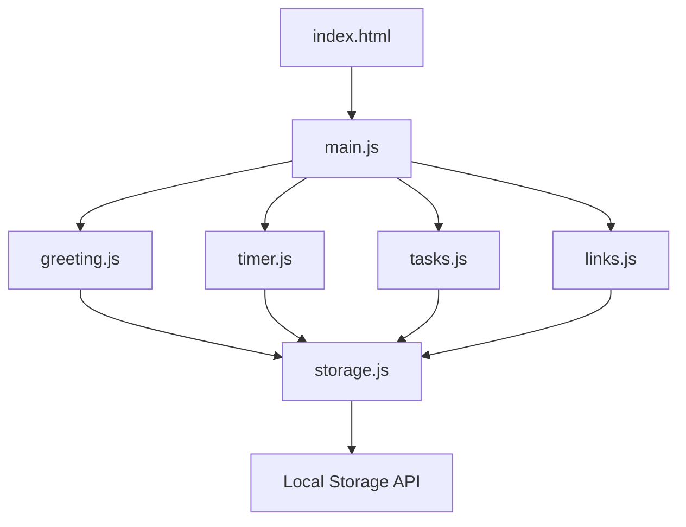

# Design Document: Productivity Dashboard

## Overview

The Productivity Dashboard is a client-side web application built with vanilla JavaScript, HTML, and CSS. It provides an integrated productivity workspace with four main components: a greeting display with time/date, a customizable focus timer, a task management system, and a quick links manager. All data is persisted locally using the Browser Local Storage API, ensuring the application works entirely offline without requiring a backend server.

The application follows a component-based architecture where each feature (greeting, timer, tasks, links) is implemented as an independent module with its own state management and DOM manipulation logic. Components communicate through a simple event system and share a common storage abstraction layer.

### Key Design Goals

- **Simplicity**: Vanilla JavaScript with no framework dependencies for fast loading and minimal complexity
- **Persistence**: All user data stored locally with automatic save on every change
- **Responsiveness**: Immediate UI feedback for all user interactions (< 100ms)
- **Modularity**: Independent components that can be developed and tested separately

## Architecture

### High-Level Structure

```
productivity-dashboard/
├── index.html              # Main HTML structure
├── styles/
│   ├── main.css           # Global styles and layout
│   ├── greeting.css       # Greeting component styles
│   ├── timer.css          # Timer component styles
│   ├── tasks.css          # Task list component styles
│   └── links.css          # Quick links component styles
├── scripts/
│   ├── main.js            # Application initialization
│   ├── storage.js         # Local storage abstraction
│   ├── greeting.js        # Greeting display component
│   ├── timer.js           # Focus timer component
│   ├── tasks.js           # Task list component
│   └── links.js           # Quick links component
└── README.md
```

### Component Architecture

The application uses a modular component pattern where each component:
- Manages its own DOM elements
- Handles its own event listeners
- Maintains its own state
- Uses the storage module for persistence



### Storage Layer

The storage module provides a unified interface for all components to interact with Local Storage:
- Abstracts localStorage API calls
- Handles JSON serialization/deserialization
- Provides error handling for storage quota issues
- Implements a consistent key naming convention

## Components and Interfaces

### Storage Module (storage.js)

**Purpose**: Centralized abstraction for Local Storage operations

**Public Interface**:
```javascript
// Get data from storage
function getItem(key)

// Save data to storage
function setItem(key, value)

// Remove data from storage
function removeItem(key)

// Check if key exists
function hasItem(key)
```

**Storage Keys**:
- `tasks`: Array of task objects
- `links`: Array of link objects
- `timerDuration`: Custom timer duration in minutes
- `taskOrder`: Array of task IDs representing display order

### Greeting Display Component (greeting.js)

**Purpose**: Display current time, date, and time-based greeting

**Public Interface**:
```javascript
// Initialize the greeting component
function init(containerElement)

// Update display (called every second)
function update()

// Get greeting text based on current time
function getGreeting(hour)
```

**State**: None (stateless, reads from system time)

**DOM Structure**:
```html
<div class="greeting-container">
  <div class="time">12:34 PM</div>
  <div class="date">Monday, January 15</div>
  <div class="greeting">Good Afternoon</div>
</div>
```

### Focus Timer Component (timer.js)

**Purpose**: Countdown timer with customizable duration

**Public Interface**:
```javascript
// Initialize the timer component
function init(containerElement)

// Start countdown
function start()

// Pause countdown
function stop()

// Reset to initial duration
function reset()

// Set custom duration
function setDuration(minutes)

// Get current duration setting
function getDuration()
```

**State**:
- `currentTime`: Remaining time in seconds
- `isRunning`: Boolean indicating if timer is active
- `intervalId`: Reference to setInterval for cleanup
- `customDuration`: User-configured duration in minutes

**DOM Structure**:
```html
<div class="timer-container">
  <div class="timer-display">25:00</div>
  <div class="timer-controls">
    <button class="btn-start">Start</button>
    <button class="btn-stop">Stop</button>
    <button class="btn-reset">Reset</button>
  </div>
  <div class="timer-settings">
    <input type="number" class="duration-input" min="1" max="120" />
    <button class="btn-set-duration">Set Duration</button>
  </div>
</div>
```

### Task List Component (tasks.js)

**Purpose**: Manage to-do items with CRUD operations

**Public Interface**:
```javascript
// Initialize the task list component
function init(containerElement)

// Add a new task
function addTask(text)

// Toggle task completion status
function toggleTask(taskId)

// Update task text
function editTask(taskId, newText)

// Delete a task
function deleteTask(taskId)

// Sort tasks by criteria
function sortTasks(criteria) // 'alphabetical' | 'completion'

// Reorder tasks (drag and drop)
function reorderTasks(taskId, newIndex)

// Check if task text is duplicate
function isDuplicate(text)
```

**State**:
- `tasks`: Array of task objects
- `taskOrder`: Array of task IDs for custom ordering

**DOM Structure**:
```html
<div class="tasks-container">
  <div class="task-input-section">
    <input type="text" class="task-input" placeholder="Add a new task..." />
    <button class="btn-add-task">Add</button>
  </div>
  <div class="task-sort-controls">
    <button class="btn-sort-alpha">A-Z</button>
    <button class="btn-sort-status">By Status</button>
  </div>
  <ul class="task-list">
    <!-- Task items rendered here -->
  </ul>
  <div class="task-notification"></div>
</div>
```

**Task Item Structure**:
```html
<li class="task-item" data-task-id="uuid" draggable="true">
  <input type="checkbox" class="task-checkbox" />
  <span class="task-text">Task description</span>
  <button class="btn-edit-task">Edit</button>
  <button class="btn-delete-task">Delete</button>
</li>
```

### Quick Links Component (links.js)

**Purpose**: Manage and display favorite website shortcuts

**Public Interface**:
```javascript
// Initialize the quick links component
function init(containerElement)

// Add a new link
function addLink(name, url)

// Delete a link
function deleteLink(linkId)

// Open a link in new tab
function openLink(url)
```

**State**:
- `links`: Array of link objects

**DOM Structure**:
```html
<div class="links-container">
  <div class="link-input-section">
    <input type="text" class="link-name-input" placeholder="Site name..." />
    <input type="url" class="link-url-input" placeholder="https://..." />
    <button class="btn-add-link">Add Link</button>
  </div>
  <div class="links-grid">
    <!-- Link buttons rendered here -->
  </div>
</div>
```

**Link Item Structure**:
```html
<div class="link-item" data-link-id="uuid">
  <button class="link-button">Site Name</button>
  <button class="btn-delete-link">×</button>
</div>
```

## Data Models

### Task Object

```javascript
{
  id: string,           // UUID v4
  text: string,         // Task description
  completed: boolean,   // Completion status
  createdAt: number,    // Unix timestamp
  updatedAt: number     // Unix timestamp
}
```

**Validation Rules**:
- `text`: Non-empty after trimming, max 500 characters
- `completed`: Boolean value
- `id`: Must be unique within tasks array

### Link Object

```javascript
{
  id: string,           // UUID v4
  name: string,         // Display name
  url: string,          // Website URL
  createdAt: number     // Unix timestamp
}
```

**Validation Rules**:
- `name`: Non-empty after trimming, max 50 characters
- `url`: Valid URL format (must start with http:// or https://)
- `id`: Must be unique within links array

### Timer Settings Object

```javascript
{
  duration: number      // Duration in minutes (1-120)
}
```

**Validation Rules**:
- `duration`: Integer between 1 and 120 (inclusive)

### Task Order Array

```javascript
[
  "task-id-1",
  "task-id-2",
  "task-id-3"
]
```

**Purpose**: Maintains custom user-defined task ordering for drag-and-drop functionality

## Correctness Properties


*A property is a characteristic or behavior that should hold true across all valid executions of a system—essentially, a formal statement about what the system should do. Properties serve as the bridge between human-readable specifications and machine-verifiable correctness guarantees.*

### Property 1: Time Formatting

*For any* valid Date object, the time formatting function should produce a string in 12-hour format with AM/PM indicator (e.g., "12:34 PM").

**Validates: Requirements 1.1**

### Property 2: Date Formatting

*For any* valid Date object, the date formatting function should produce a string containing the day of week, month name, and day number (e.g., "Monday, January 15").

**Validates: Requirements 1.2**

### Property 3: Time-Based Greeting

*For any* hour value (0-23), the greeting function should return "Good Morning" for hours 5-11, "Good Afternoon" for hours 12-16, "Good Evening" for hours 17-20, and "Good Night" for hours 21-4.

**Validates: Requirements 2.1, 2.2, 2.3, 2.4**

### Property 4: Timer Start Countdown

*For any* valid timer state with a positive time value, starting the timer should set the running state to true and enable countdown behavior.

**Validates: Requirements 3.2**

### Property 5: Timer Stop Preserves State

*For any* running timer with remaining time, stopping the timer should preserve the current time value and set the running state to false.

**Validates: Requirements 3.5**

### Property 6: Timer Reset to Duration

*For any* timer state, resetting should set the displayed time to the configured duration (default 25 minutes or custom value) and set the running state to false.

**Validates: Requirements 3.6, 16.3**

### Property 7: Task Creation and Display

*For any* non-empty task text, creating a task should add a new task object to the task list with the provided text, uncompleted status, and a unique ID.

**Validates: Requirements 4.1, 4.2**

### Property 8: Task Persistence Round-Trip

*For any* task object, saving it to storage and then retrieving all tasks should return a task list containing an equivalent task with the same text, completion status, and ID.

**Validates: Requirements 4.3, 5.4, 6.3, 8.1, 8.2**

### Property 9: Empty Task Rejection

*For any* string composed entirely of whitespace characters (including empty string), attempting to create a task should be rejected and the task list should remain unchanged.

**Validates: Requirements 4.4, 6.4**

### Property 10: Task Completion Toggle Round-Trip

*For any* task, toggling its completion status twice should return it to its original completion state.

**Validates: Requirements 5.1, 5.3**

### Property 11: Task Completion Styling

*For any* task marked as completed, the rendered DOM element should include a visual indicator (CSS class or style) that distinguishes it from uncompleted tasks.

**Validates: Requirements 5.2**

### Property 12: Task Edit Mode Display

*For any* task, activating edit mode should render an input field containing the current task text as its value.

**Validates: Requirements 6.1**

### Property 13: Task Text Update

*For any* task and any non-empty new text, updating the task text should change the task's text property to the new value while preserving its ID and completion status.

**Validates: Requirements 6.2**

### Property 14: Task Deletion

*For any* task in the task list, deleting it should remove it from both the displayed list and Local Storage, such that subsequent retrieval does not include the deleted task.

**Validates: Requirements 7.1, 7.2**

### Property 15: Link Creation and Display

*For any* non-empty link name and valid URL, creating a link should add a new link object to the link list and render it as a clickable button with the provided name.

**Validates: Requirements 9.1, 9.2**

### Property 16: Link Persistence Round-Trip

*For any* link object, saving it to storage and then retrieving all links should return a link list containing an equivalent link with the same name, URL, and ID.

**Validates: Requirements 9.3, 12.1, 12.2**

### Property 17: Invalid Link Rejection

*For any* link submission where the name is empty (after trimming) or the URL is empty (after trimming), the link should not be created and the link list should remain unchanged.

**Validates: Requirements 9.4**

### Property 18: Link Navigation

*For any* link with a valid URL, clicking the link button should trigger navigation to that URL in a new browser tab (window.open called with correct URL and '_blank' target).

**Validates: Requirements 10.1**

### Property 19: Link Deletion

*For any* link in the link list, deleting it should remove it from both the displayed list and Local Storage, such that subsequent retrieval does not include the deleted link.

**Validates: Requirements 11.1, 11.2**

### Property 20: Custom Timer Duration Update

*For any* valid duration value between 1 and 120 minutes (inclusive), setting the custom duration should update the timer's configured duration and use that value for subsequent resets.

**Validates: Requirements 16.2**

### Property 21: Timer Duration Persistence Round-Trip

*For any* valid custom duration value, saving it to storage and then retrieving the duration setting should return the same duration value.

**Validates: Requirements 16.4, 16.5**

### Property 22: Duplicate Task Detection

*For any* existing task text and any new task text that matches it (case-insensitive, ignoring leading/trailing whitespace), attempting to create the new task should be rejected, the task list should remain unchanged, and a notification should be displayed.

**Validates: Requirements 17.1, 17.2, 17.3, 17.4, 17.5**

### Property 23: Alphabetical Task Sorting

*For any* task list, applying alphabetical sort should reorder the tasks such that task texts are in lexicographic order (case-insensitive).

**Validates: Requirements 18.1**

### Property 24: Completion Status Sorting

*For any* task list containing both completed and uncompleted tasks, applying completion status sort should reorder the tasks such that all uncompleted tasks appear before all completed tasks.

**Validates: Requirements 18.2**

### Property 25: Task Reordering

*For any* task list and any valid task ID and new position index, reordering the task should update the task list such that the specified task appears at the new position.

**Validates: Requirements 18.3**

### Property 26: Task Order Persistence Round-Trip

*For any* custom task order (array of task IDs), saving it to storage and then retrieving the order should return the same sequence of task IDs.

**Validates: Requirements 18.4, 18.5**

### Property 27: Color Contrast Compliance

*For any* text element and its background color in the application, the contrast ratio should meet or exceed 4.5:1 (WCAG AA standard for normal text).

**Validates: Requirements 15.3**

## Error Handling

### Storage Errors

**Quota Exceeded**: When Local Storage quota is exceeded:
- Catch `QuotaExceededError` exceptions
- Display user-friendly error message: "Storage limit reached. Please delete some items."
- Prevent further save operations until space is available
- Log error to console for debugging

**Storage Unavailable**: When Local Storage is disabled or unavailable:
- Detect at application initialization
- Display warning message: "Local storage is disabled. Your data will not be saved."
- Allow application to function in memory-only mode
- Gracefully degrade persistence features

### Input Validation Errors

**Invalid Task Text**:
- Empty or whitespace-only: Silent rejection, no error message
- Duplicate task: Display notification "This task already exists"
- Exceeds max length (500 chars): Display error "Task description too long (max 500 characters)"

**Invalid Link Data**:
- Empty name or URL: Silent rejection, no error message
- Invalid URL format: Display error "Please enter a valid URL starting with http:// or https://"
- Name exceeds max length (50 chars): Display error "Link name too long (max 50 characters)"

**Invalid Timer Duration**:
- Value < 1 or > 120: Display error "Duration must be between 1 and 120 minutes"
- Non-numeric input: Display error "Please enter a valid number"

### Data Corruption

**Malformed Storage Data**: When retrieving data from Local Storage:
- Wrap JSON.parse in try-catch
- If parsing fails, log error and initialize with empty data
- Display warning: "Could not load saved data. Starting fresh."
- Do not crash the application

**Missing Required Fields**: When loading tasks or links:
- Validate each object has required fields (id, text/name, etc.)
- Skip objects with missing required fields
- Log warning for each skipped item
- Continue loading valid items

### DOM Errors

**Element Not Found**: When initializing components:
- Check that container elements exist before initialization
- Throw descriptive error if required elements are missing
- Fail fast during initialization rather than at runtime

## Testing Strategy

### Unit Testing

The application will use **Jest** as the testing framework for unit tests. Unit tests will focus on:

**Specific Examples**:
- Default timer displays 25:00 on load
- Empty storage results in empty task list
- Timer at 00:00 stops automatically
- Font size is minimum 14px for body text
- Timer settings input field is present

**Edge Cases**:
- Timer duration boundaries (1 minute, 120 minutes)
- Empty storage (no tasks, no links, no custom duration)
- Task list with only completed tasks
- Task list with only uncompleted tasks
- Single task in list
- Maximum length task text (500 characters)
- Maximum length link name (50 characters)

**Error Conditions**:
- Storage quota exceeded
- Malformed JSON in storage
- Invalid URL formats
- Non-numeric timer duration input
- Missing required DOM elements

**Integration Points**:
- Storage module integration with each component
- Component initialization sequence
- Event listener setup and cleanup

### Property-Based Testing

The application will use **fast-check** (JavaScript property-based testing library) for property tests. Each property test will:

- Run a minimum of 100 iterations with randomized inputs
- Include a comment tag referencing the design document property
- Tag format: `// Feature: productivity-dashboard, Property {number}: {property_text}`

**Property Test Configuration**:
```javascript
import fc from 'fast-check';

// Example property test structure
describe('Property Tests', () => {
  it('Property 1: Time Formatting', () => {
    // Feature: productivity-dashboard, Property 1: Time formatting
    fc.assert(
      fc.property(fc.date(), (date) => {
        const formatted = formatTime(date);
        // Assertions here
      }),
      { numRuns: 100 }
    );
  });
});
```

**Generators Needed**:
- Random valid task text (1-500 chars, non-whitespace)
- Random whitespace strings (empty, spaces, tabs, newlines)
- Random task objects with valid fields
- Random link objects with valid URLs
- Random timer durations (1-120)
- Random invalid durations (< 1, > 120)
- Random hours (0-23)
- Random dates
- Random task lists (0-100 tasks)
- Random link lists (0-50 links)
- Random color pairs for contrast testing

**Property Test Coverage**:
Each of the 27 correctness properties listed above will be implemented as a single property-based test. The tests will verify:
- Formatting functions (time, date, greeting)
- Timer state transitions (start, stop, reset)
- Task CRUD operations and persistence
- Link CRUD operations and persistence
- Sorting and reordering behavior
- Input validation and duplicate detection
- Accessibility requirements (contrast ratios)

### Test Organization

```
tests/
├── unit/
│   ├── storage.test.js
│   ├── greeting.test.js
│   ├── timer.test.js
│   ├── tasks.test.js
│   └── links.test.js
├── property/
│   ├── formatting.property.test.js
│   ├── timer.property.test.js
│   ├── tasks.property.test.js
│   ├── links.property.test.js
│   └── accessibility.property.test.js
└── helpers/
    ├── generators.js
    └── test-utils.js
```

### Testing Balance

- Unit tests provide concrete examples and catch specific bugs
- Property tests verify general correctness across all inputs
- Together they provide comprehensive coverage without redundancy
- Avoid writing too many unit tests for cases covered by properties
- Focus unit tests on integration, edge cases, and error conditions
- Use property tests for universal rules and data transformations

